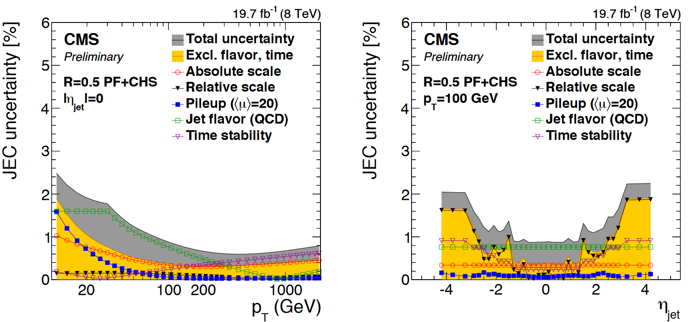

::::::::::::: questions

- How are statistical uncertainties modeled in CMS for simulation and data?
- How are systematic uncertainties modeled in CMS?
- What are some of the most common uncertainties for CMS physics objects?

:::::::::::::

::::::::::::: objectives

- Learn what the error bars mean on CMS plots.
- Learn about collision, detector, and data-to-simulation correction uncertainties.
- Identify some published resources with more information.

:::::::::::::

## Statistical uncertainties

**Data**: observations by CMS, such as the number of events in data that pass a certain set of selection criteria, are not in and of themselves uncertain.
However, all CMS plots show error bars on data in histograms of observables. Let's view again the image from the $Z'$ search:

In this figure, many bins show an observation of 0 events in data, particularly in the high mass region. It is clear that this is not a fundamental statement that no events could ever be observed in those mass ranges, but merely a truth of this particular dataset collected by CMS in 2016.

For any observable, such as the number of $t\bar{t}$ events produced in CMS whose reconstructed mass lies in the 20th bin of the figure above, there is some "true" mean number of events per 35.9 fb$^{-1}$ of data collected. This true mean number could perhaps be deduced by CMS repeating its 2016 data collection over and over again many times and finding in each dataset how many events lie in the 20th bin of this plot. But since we are analyzing just one iteration of 2016 data, we must let the observation in this dataset serve as our best estimate of the true mean. Each collision exhibiting a given set of properties is an independent random event, and so their probability follows the **Poisson distribution**, which has the unique feature that its standard deviation is the square root of the mean. If our best estimate of the true mean is the observation we have in hand, then our best estimate of the variance is the square root of the observation. This estimate is generally reasonable, until the observation becomes very small, such as zero events. In this case, the asymmetric shape of the Poisson distribution is better illustrated by an upward pointing error bar from 0 that describes a one-sided 68% confidence limit.

**MC**: similar to the argument for data, uncertainty due to the limited size of a simulated sample is typically the **square root of the sum of squared weights** in any given bin. The goal for simulation is to always have sufficient *generated* events for any sample that the weights are small.

## Systematic uncertainties

While systematic uncertainties have many different sources and are computed in many differen ways, the general underlying assumption is that the variation of an observable due to systematic uncertainty can be described by the **Gaussian distribution**, or by a **log-normal distribution** if negative values are not physical. Experimental uncertainties are usually provided as "up" and "down" shifts of a parameter, with the assumption that the "up"/"down" settings model a variation of one standard deviation.

The following sections give a brief introduction to some of the most common experimental systematic uncertainties for CMS analyses. It is not an exhaustive list, but a good start. 

### Collision conditions

**Luminosity**: the luminosity uncertainty affects the number of predicted events for any simulated sample. A simulated sample is weighted based on (luminosity) $\times$ (cross section) / (number of generated events), so uncertainty in the luminosity can be directly converted to uncertainty in the number of signal or background events in any observable. The luminosity uncertainty for 2016 data is 1.2%.

**Pileup**: in simulation, the number of simultaneous interactions per bunch crossing is modeled by Pythia, based on measurements of the total cross section for inelastic proton-proton scattering. In Pythia the typical inelastic cross section for 13 TeV collisions is 80 mb, while CMS measures 69.2 mb, with an uncertainty of 4.6%. Simulation is reweighted to the CMS inelastic cross section, and the uncertainty of 4.6% is propagated to analysis observables via a pair ("up" and "down") of shifted weights.

### Detector response corrections

**Jet energy scale**: The [Physics Object pre-learning lesson](https://cms-opendata-workshop.github.io/workshop2024-lesson-physics-objects/instructor/06-jecjer.html) describes the various individual corrections that make up the total "jet energy scale" correction. This set of corrections adjusts the calculation of jet energy and momentum to remove effects from pileup (extra energy in a jet) and imperfect detector response (too little energy in a jet). Each individual correction is a source of uncertainty -- at minimum because the corrections are derived in limited-size samples.

The figure below shows JES uncertainties from Run 1. The L1 (pileup) correction uncertainty dominates at low momentum,
while the L3 (absolute scale) correction uncertainty takes over for higher momentum jets. All corrections are quite precise for
jets located near the center of the CMS barrel region, and the precision drops as pseudorapidity increases and different
subdetectors lose coverage. 

{width="70%"}

JES uncertainties modify the **energy-momentum 4-vector** of a jet, which tends to affect other overables in an analysis that are computed using jets or MET. These variations must be propagated all the way through to the final observable. CMS provides JES uncertainties as a total variation, and also from individual sources. 

**Jet energy resolution**: The JER correction changes the *width* of the jet momentum distribution, rather than its *position*. The correction is provided as a set of "scale factors", or multipliers, that affect the amount of Gaussian smearing applied to jet momentum in simulation. The scale factors in various pseudorapidity bins each have an uncertainty that comes from treatment of extra radiation in data, differences in MC generators, and other effects. The figure below shows the scale factors and their uncertainties from Run 1. Note how the larger data sample available for 8 TeV collisions corresponds to smaller uncertainties on the scale factors compared to 7 TeV! JER uncertainties also affect the **energy-momentum 4-vector** of a jet, independent from the JES variations! 

{width="50%"}

**Lepton energy scale and resolution**: in precision measurements, leptons can also benefit from corrections for energy scale and resolution. While all analyses using jets must apply the JES corrections, not all analyses require these corrections for leptons. As the name suggests, *CMS* has a very strong muon detector and robust reconstruction algorithms, so extra muon energy corrections are not common. Similar for electrons -- scale and smear studies are performed by the group responsible for electron reconstruction and identification, but they are not required for use in all analyses.

Lepton scale and resolution corrections affect the **energy-momentum 4-vector** of a lepton, so their uncertainties would be propagated to the final observable by repeating any calculations involving leptons using the energy/momentum variations. You can read more about the lepton energy scale measurements in the following papers: 

* Muon performance: https://arxiv.org/abs/1804.04528
* Electron and photon performance: https://arxiv.org/abs/2012.06888
* Tau performance: https://arxiv.org/abs/1809.02816

### Data/MC scale factors

::::::::: callout

## What is a scale factor?

A "scale factor" is a number that should be multiplied onto some quantity so that it matches a different quantity. In CMS, scale factors usually adjust the **event weight** of a simulated event, so that histograms filled by simulated events match the histogram of the same observable in data.

:::::::::

**Trigger**: analysts often apply the same trigger path in data and simulation. But the efficiency of the trigger path depends on the kinematics of the physics objects used, and it might vary between data and simulation. Most analysts need to compute the efficiencies of the triggers they use, and then compute scale factors comparing data and simulation efficiencies. The uncertainty in each efficiency can be propagated to the scale factor, and then to the final analysis observable. 

**Leptons**: selecting leptons usually involves choosing an identification criterion and an isolation criterion. The efficiency of these algorithms to identify "true" leptons can vary between simulation and data! For muons and electrons, scale factors are typically calculated using [Z boson tag-and-probe](https://cms-opendata-workshop.github.io/workshop-lesson-tagandprobe/aio/index.html), which was featured in an earlier workshop.

Tag and probe can be done with any 2-lepton resonance, such as $J/\psi$ or $\Upsilon$ mesons, though $Z$ bosons are preferred for higher-momentum leptons. Events are selected with two leptons of the same flavor but opposite charge, and a stringent requirement is placed on the invariant mass of the lepton pair, so that we can be reasonably sure the event was "really" the desired resonance particle. For these events, we are then reasonably sure that both leptons are "true" signal leptons, not the result of detector noise. In the tag-and-probe process, the "tag" lepton is required to pass selection criteria that reject large fractions of "background" or "noise" leptons. The *other* lepton is the probe, and the rate at which it passes or fails any number of selection criteria can be tested. The figure below shows how distributions of the resonance mass are fitted to extract the number of particles whose probe lepton passed the criteria.

{width="100%"}

Uncertainties in scale factors calculated using the tag-and-probe procedure can come from a variety of sources:

 * Change the binning of the histograms
 * Change the resonance particle mass range accepted
 * Change the functional form used to fit the signal
 * Change the functional form used to fit the background
 * Statistical uncertainty
 * Uncertainty in the fit parameters

Thankfully, these variations usually result in only small changes to the efficiency and therefore the scale factor! They are usually combined in quadrature to one variation. You can read more in the lepton performance papers:

* Muon performance: https://arxiv.org/abs/1804.04528
* Electron and photon performance: https://arxiv.org/abs/2012.06888
* Tau performance: https://arxiv.org/abs/1809.02816

**Jet identification**: The jet identification algorithm designed to reject noise jets is usually 98-99% efficienct for true jets, and this efficiency tends to match between data and simulation, so most analyses do not include a scale factor or uncertainty for this algorithm. Yay!

However, jets more than make up for the efficiency of their noise-rejection ID with the complexity of the scale factors and uncertainties for parent-particle identification algoriths like b tagging, W tagging, or top tagging. The goal of scale factors for these algorithms is the same as all others: bring simulation to match data. But while "detector noise" versus "actual jet" is a fairly concrete question, "b quark jet" versus "c quark jet" is much more subtle. In simulation, where the "true" parent particles behind any jet can be determined, it is fairly straightforward to measure the efficiency with which true t, W, Higgs, Z, b, c, or light quark jets will pass a certain tagging criterion. But to measure the same in data, an event selection must be defined that can bring "reasonable certainty", as we mentioned for tag-and-probe, that the jets considered are actually b quark jets, W boson jets, top quark jets, etc. As in the case of tag-and-probe, calculating these efficiencies will usually involve fits that bring in many sources of uncertainty. The uncertainties can vary based on jet kinematics and the jet's parent particle.

Scale factors and their uncertainties for many jet identification algorithms in the 2016 dataset are documented in the following sources:

* Identification of b and c quarks: https://cds.cern.ch/record/2854609/
* Double-b identification for Higgs bosons: http://cds.cern.ch/record/2866276
* Heavy particle identification (H, W, t): https://arxiv.org/abs/2004.08262

### Analysis method choices

Uncertainties for corrections to physics objects are often provided by CMS, at least for any required corrections, and for the most popular identification algorithms. But uncertainties also arise from analysis strategy choices. There is no way to write an exhaustive list of these uncertainties! But as you build an analysis, consider:

 * Have I calculated any custom corrections for physics objects?
 * Have I performed any fits to model background and/or signal?
 * Have I computed any "transfer factors" to model background in a certain region using information from other regions?
 * Have I designed a validation procedure for my background modeling strategy?

All of these methods, and surely others, will need to be evaluated for uncertainties that should be propagated to your final observable. Uncertainties in fit parameters, statistical uncertainties in various regions, any deviation from expectations in a validation procedure -- all are examples of analysis method uncertainties you might find in CMS papers and consider in your work.

::::::::::::: keypoints

- Data in CMS plots carry error bars that serve as a "best estimate" of the variance of the Poisson distribution that governs the expected observations for each observable.
- Systematic uncertainties are assumed to follow Gaussian or log-normal probability distributions.
- Collision-based uncertainties come from the luminosity and pileup calculations.
- Detector-based uncertainties come from corrections to the energy response for different physics objects.
- Scale factor-based uncertainties come from the calculation methods used to measure efficiencies for various reconstruction, identification, isolation, and trigger algorithms.
- Analysis methods also bring in uncertainties that need to be determined by the analysis team.

:::::::::::::
