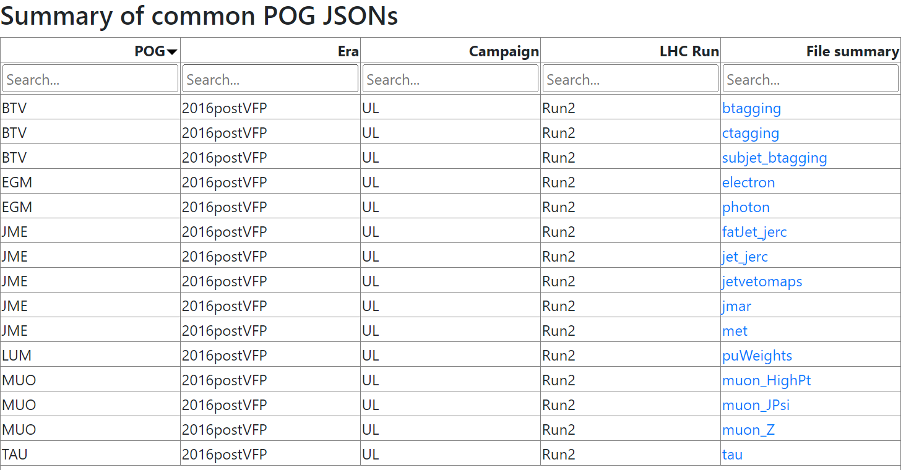
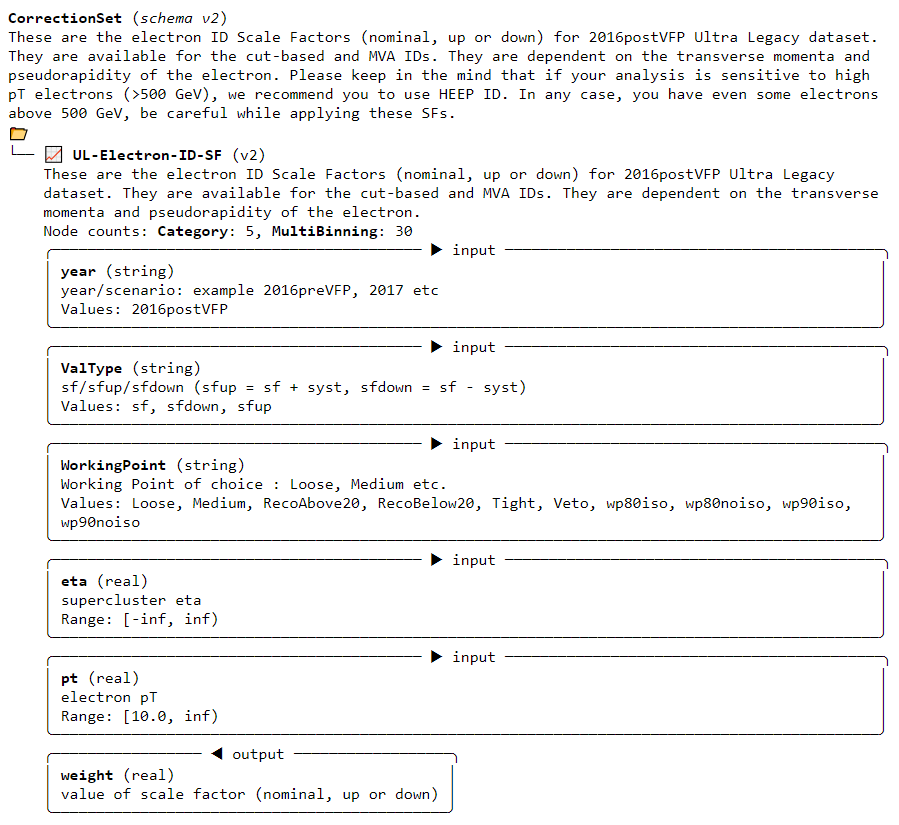

::::::::::: questions

- What corrections are provided by CMS for pileup?
- What corrections are provided by CMS for leptons?
- What corrections are provided by CMS for jets and MET?
- How can I access the corrections?

:::::::::::

::::::::::: objectives

- Explore the corrections webpage for 2016 data.
- Install the framework used by CMS to apply the common experimental corrections.
- Learn how to access a correction and its numerical value.

:::::::::::

::::::::::::: prereq

## 2016 corrections webpage

Open this website in your browser! https://opendata.cern.ch/eos/opendata/cms/corrections/jsonpog-integration-summary/index.html

:::::::::::::

CMS provides all of the corrections that are "required" for sensible analysis results (in most cases), and also provides scale factors for some of the most common identification and isolation algorithms. Prior to 2016, these corrections were shared with analysts as histograms, via PDF files, via TWiki pages, or other forms, and each group calculating a correction could choose the format. For Run 2 data, a common JSON format has been introduced that simplifies and unifies the process of accessing correction values and their uncertainties.

## Exploring the json format

When you click on the website link above, you should see the following page:



The columns describe:

 * The acronym of the CMS group that produced the correction:
   * BTV = B-tagging & vertexing
   * EGM = E & Gamma (electrons & photons)
   * JME = Jets & MET
   * LUM = Luminosity, including pileup
   * MUO = Muons
   * TAU = Tau leptons
 * Information about the CMS dataset:
   * Era: currently, the page shows "2016postVFP", which applies to the Run2016G and Run2016H data released in 2024. As we release more Run 2 data, additional eras will appear on this website.
   * Campaign: "UL" = "Ultra-Legacy". The open data released for 2016 is not the earliest processing of 2016 data, but the final processing that is uniform with the rest of the Run 2 data that will be released in coming years.
   * LHC Run: Run 2! If you revisit this site in 2028 or 2029 you might begin to see some "Run 3" corrections.
 * The files available with corrections. These are clickable links that take you to a summary page for the corrections contained within that file.

Click on a correction file to explore it!

One of the simplest examples is the [electron correction file](https://opendata.cern.ch/eos/opendata/cms/corrections/jsonpog-integration-summary/summaries/EGM_2016postVFP_UL_electron.html). When clicking on that link, you see a description of the correction contained in the file:



::::::: challenge

## Identify correction elements

Important information for accessing the correction in an analysis is included on this page.  Look and find:

 * The **name** of the correction
 * The required **input values**: what information must you provide to get a correction value out of this JSON file? What types are the required inputs? What ranges can the inputs take?
 * The expected **output value**: what piece of information will be returned by the correction? What type will it have?

:::: solution

For the electron correction, the **name** is "UL-Electron-ID-SF". The "(v2)" that appears next to the name is indicating a version of the correction JSON software, and is not part of the name.

There are five **input values** required to access the electron correction:
 * "year": this is unfortunately a bit redundant, but you must provide the string "2016postVFP" when accessing this correction.
 * "ValType": this input allows you to specify whether you would like to access the scale factor ("sf") or one of its systematic uncertainty variations ("sfdown", "sfup").
 * "WorkingPoint": this inputs allows you to specify which electron identification algorithm you are using.
   * "RecoAbove20", "RecoBelow20": these names will access scale factors for the electron reconstruction algorithm for electrons with energy either above or below 20 GeV.
   * "Veto", "Loose", "Medium", "Tight": these are the working points of the `Electron\_cutBased` identification algorithm.
   * "wp80iso", "wp80noiso", "wp90iso", "wp90noiso": these are the working points of the MVA identification algorithm. The number indicates the efficiency for identifying true electrons (80% or 90%), and "iso"/"noiso" indicates whether or not isolation was included in the training variables for the MVA. In NanoAOD the branches for these identification algorithms look like `Electron_mvaFall17V2*_WP*`.
 * The $\eta$ and $p_T$ values for the electron. Both are to be provided as `float` values, and the electron's $p_T$ value must be larger than 10 GeV for the correction to be found.

The output will be a float that corresponds to a **scale factor**. The scale factor or one of its systematic variations should be multiplied onto the event weight. We will show this in an upcoming exercise.

::::

::::::::::::::::

Explore other correction files for jets, leptons, etc. The table below gives a basic map of what you expect to find in the different files:

Table: high-level summary of which types of corrections live in which JSON files

| Correction type | Physics object | File |
| --------------- | -------------- | ---- |
| Collision       | Pileup         | puWeights |
| Detector response | Jets | jet_jerc, fatjet_jerc, jetvetomaps |
| Detector response | MET | met |
| Detector response | Taus | tau |
| Scale factors | Muons | muon_JPsi, muon_Z, muon_HighPt |
| Scale factors | Electrons | electron |
| Scale factors | Photons | photon |
| Scale factors | Taus | tau |
| Scale factors | Jets | btagging, ctagging, subjet_btagging, jmar |

:::::::::: challenge

## Install correctionlib

Open your python docker container and install `correctionlib`:

```bash
docker start -i my_python
pip install correctionlib
```

After `pip` installs any dependencies, you should see a message that version 2.6.1 has been installed:

```output
Successfully installed correctionlib-2.6.1
```

Download all the corrections files and unpack them:

```bash
wget https://opendata.cern.ch/eos/opendata/cms/corrections/jsonpog-integration-2016post.tar
tar -xf jsonpog-integration-2016post.tar
rm jsonpog-integration-2016post.tar
```

You should now see a folder called "POG" in your container with subdirectories for each CMS group:

```bash
ls POG/
```

```output
BTV  EGM  JME  LUM  MUO  TAU
```

::::::::::::

In the final episode, we will see how to use the `correctionlib` package to access the corrections in the files 

::::::::::: keypoints

- The available 2016 corrections and a summary website can be accessed from the Open Data Portal (a "record" page for the corrections is forthcoming).
- Mandatory corrections such as pileup and jet energy corrections are provided.
- Scale factors for many reconstruction and identification algorithms are also provided.
- The summary webpage is the best reference to understand the names, inputs, and outputs of the corrections. 

:::::::::::