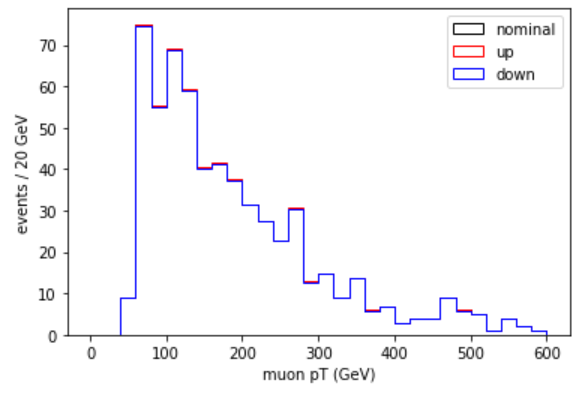
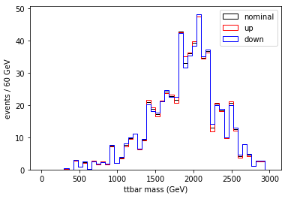
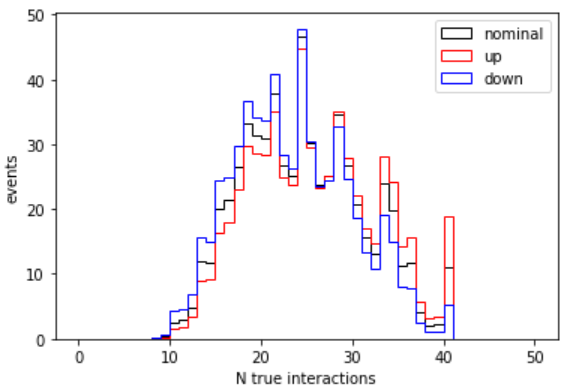

:::::::::: questions

- How do I use correctionLib to evaluate a scale factor and its uncertainty?
- How do I propagate an uncertainty through my analysis?

::::::::::

:::::::::: objectives

- Use correctionLib in the python environment to access scale factors.
- Compute shifted variables within the $Z'$ analysis
- Store histograms in a ROOT file for the next lesson

:::::::::::

The goal of this exercise is to use the `correctionlib` tool to access some scale factors and apply them to our $Z`$ search.
We will also see one way to store histograms in a `ROOT` file for use in the next lesson on statistical inference.

:::::::: prereq

For the activities in this session you will need:

 * Your python docker container and ROOT docker container
 * `correctionlib` installed in your python container
 * The `POG/` folder of correction files
 * At least one `.csv` file produced in the lessons yesterday.

:::::::::

## Demo: muon scale factors

To show how to open and use a correction file, we will walk through the following notebook together as a demonstration.
Download a notebook and launch jupyter-lab:

```bash
docker start -i my_python
code/$ wget https://github.com/cms-opendata-workshop/workshop2024-lesson-uncertainties/blob/41b1b9ef0c680eeff6883a86bf379ae2ccccd545/learners/CorrectionLib_demo.ipynb
code/$ jupyter-lab --ip=0.0.0.0 --no-browser
```

Double-click on this notebook in the file menu of jupyter-lab. This notebook shows how to access the scale factor for our muon identification algorithm.

::::::::::: spoiler

## Correctionlib demo notebook contents

```python
import matplotlib.pylab as plt
import numpy as np
import correctionlib
```

### Open a .csv file into an array

**Replace the .csv file name below with one that you have in your container.**


```python
signal = np.genfromtxt('output_signal_22BAB5D2-9E3F-E440-AB30-AE6DBFDF6C83.csv', delimiter=',', names=True, dtype=float)
```

### Open a correction file and access the muon tight ID correction


```python
import gzip
with gzip.open("POG/MUO/2016postVFP_UL/muon_Z.json.gz",'rt') as file:
    data = file.read().strip()
    evaluator = correctionlib._core.CorrectionSet.from_string(data)
    
tightIDSF = evaluator["NUM_TightID_DEN_TrackerMuons"]
```

### Get the input lists we need and evaluate the correction

The `evaluate` method in `correctionlib` is used to access specific correction values. 
In python, this function uses the syntax: `evaluate(input 1, input 2, input 3, ...)`. The inputs should be provided in the order they appear on the summary webpage of the correction. The muon correction we are showing here cannot accept numpy arrays inside the `evaluate` call, so we will iterate over the input arrays.


```python
muon_pt = signal['mu_pt']
muon_abseta = signal['mu_abseta']
genWeight = signal['weight']
```


```python
leadmuon_sf = [tightIDSF.evaluate(eta,pt,"nominal") for pt,eta in zip(muon_pt,muon_abseta)]
leadmuon_sfup = [tightIDSF.evaluate(eta,pt,"systup") for pt,eta in zip(muon_pt,muon_abseta)]
leadmuon_sfdn = [tightIDSF.evaluate(eta,pt,"systdown") for pt,eta in zip(muon_pt,muon_abseta)]
```


```python
print(leadmuon_sf[0:10])
print(leadmuon_sfup[0:10])
print(leadmuon_sfdn[0:10])
```

### Plot the effect of this uncertainty on the Z' mass


```python
plt.hist(muon_pt,bins=30,range=(0,600),weights=genWeight*leadmuon_sf,histtype="step",color="k",label="nominal")
plt.hist(muon_pt,bins=30,range=(0,600),weights=genWeight*leadmuon_sfup,histtype="step",color="r",label="up")
plt.hist(muon_pt,bins=30,range=(0,600),weights=genWeight*leadmuon_sfdn,histtype="step",color="b",label="down")
plt.legend()
plt.xlabel('muon pT (GeV)')
plt.ylabel('events / 20 GeV')
plt.show()
```

{width="50%"}

:::::::::::::

## Exercise: implement pileup reweighting

:::::::::: challenge

## Implement pileup reweighting

Follow the example of the previous notebook to implement pileup reweighting on your own!

Suggestions:

 * Revisit the corrections website to learn the name of and inputs to the pileup correction
 * Access any required inputs from your .csv file
 * Adjust the muon example to read the correct file and access the right correction

You can work in the same notebook that you downloaded for the muon correction.

::::: solution

### Open the pileup correction file and access the correction

```python
with gzip.open("POG/LUM/2016postVFP_UL/puWeights.json.gz",'rt') as file:
    data = file.read().strip()
    evaluator = correctionlib._core.CorrectionSet.from_string(data)
    
pileupcorr = evaluator["Collisions16_UltraLegacy_goldenJSON"]
```

### Get the necessary inputs from the data array and call evaluate
```python
pu = signal['pileup']

pu_sf = [pileupcorr.evaluate(nInts,"nominal") for nInts in pu]
pu_sfup = [pileupcorr.evaluate(nInts,"systup") for nInts in pu]
pu_sfdn = [pileupcorr.evaluate(nInts,"systdown") for nInts in pu]

```

### Plot the Z' mass with the pileup weight applied, and its uncertainty shifts
```python
plt.hist(signal['mtt'],bins=50,range=(0,3000),weights=genWeight*pu_sf,histtype="step",color="k",label="nominal")
plt.hist(signal['mtt'],bins=50,range=(0,3000),weights=genWeight*pu_sfup,histtype="step",color="r",label="up")
plt.hist(signal['mtt'],bins=50,range=(0,3000),weights=genWeight*pu_sfdn,histtype="step",color="b",label="down")
plt.legend()
plt.xlabel('m(tt) (GeV)')
plt.ylabel('events / 60 GeV')
plt.show()
```

{width="50%"}

This uncertainty is larger than the muon scale factor uncertainty! It is also interesting to plot the uncertainty
in the pileup distribution itself:

{width="50%"}

:::::

:::::::::::::

## Demo: convert to ROOT histograms

To prepare for the final step of our analysis example, we need to store our histograms in the `ROOT` file format.
In yesterday's exercise to make a plot with data, background, and signal, you saw some ways to handle information
from multiple samples. This example will be similar: we will read in the full `.csv` output from the entire
signal, background, and collision datasets and produce a histogram. But this time we will also evaluate uncertainties
and convert the data to ROOT. Because our `correctionlib` infrastructure lives in the python container, we will make
histograms in the python container, and then write them to a ROOT file in the ROOT container.

Download the following notebook and follow along. In jupyter-lab, you can open a terminal to perform the download.

```bash
wget https://github.com/cms-opendata-workshop/workshop2024-lesson-uncertainties/blob/41b1b9ef0c680eeff6883a86bf379ae2ccccd545/learners/HistsWithWeights.ipynb
```

We will walk through this notebook together. It does not introduce any significant new skills or knowledge, but
repeats the type of processing we have done before on multiple samples at once.

::::::: spoiler

## Histogram prep notebook contents

```python
import matplotlib.pylab as plt
import numpy as np
import correctionlib
import os
```

### Read CSV files

First, we will open the .csv files we saved during the event selection process and store all the data in a dictionary. We will also create a dictionary to hold the number of events for each sample that we found in yesterday's background modeling lesson. The keys of these dictionaries will be the types of data samples we are using in this search.


```python
datadict = {}
datadict['signal'] = np.genfromtxt('SUMMED_signal_M2000.csv', delimiter=',', names=True, dtype=float)
datadict['tt_semilep'] = np.genfromtxt('SUMMED_ttsemilep.csv', delimiter=',', names=True, dtype=float)
datadict['tt_had'] = np.genfromtxt('SUMMED_tthadronic.csv', delimiter=',', names=True, dtype=float)
datadict['tt_lep'] = np.genfromtxt('SUMMED_ttleptonic.csv', delimiter=',', names=True, dtype=float)
datadict['wjets'] = np.genfromtxt('SUMMED_Wjets.csv', delimiter=',', names=True, dtype=float)
datadict['data'] = np.genfromtxt('SUMMED_collision.csv', delimiter=',', names=True, dtype=float)
```


```python
N_gen = {'signal':527218.0, 
         'tt_semilep':143553998.0, 
         'tt_had': 100522516.0, 
         'tt_lep':41777512.0, 
         'wjets':20521145.0,
         'data':0.0}
```

### Open correctionlib files

Now we will load the two correctionlib JSON files that we used in the earlier examples, and access the specific corrections that we need.


```python
import gzip
with gzip.open("POG/LUM/2016postVFP_UL/puWeights.json.gz",'rt') as file:
    data = file.read().strip()
    evaluator = correctionlib._core.CorrectionSet.from_string(data)
with gzip.open("POG/MUO/2016postVFP_UL/muon_Z.json.gz",'rt') as file:
    data = file.read().strip()
    evaluatorMU = correctionlib._core.CorrectionSet.from_string(data)
    
pucorr = evaluator["Collisions16_UltraLegacy_goldenJSON"]
mucorr = evaluatorMU["NUM_TightID_DEN_TrackerMuons"]
```

### Store data for histograms

Now we will use the data we read from the .csv files to evaluate the 2 corrections and their uncertainties. We will slim down the number of variables that we need to create our final Z' mass histograms and put everything in a final dictionary.


```python
histoData = {}
for sample in datadict.keys():
    histoData[sample] = {
        "N_gen": N_gen[sample],
        "genWeight": datadict[sample]['weight']/np.abs(datadict[sample]['weight']),
        "mtt": datadict[sample]['mtt'],
        "pu_weight": [pucorr.evaluate(n,"nominal") for n in datadict[sample]['pileup']],
        "pu_weight_up": [pucorr.evaluate(n,"up") for n in datadict[sample]['pileup']],
        "pu_weight_dn": [pucorr.evaluate(n,"down") for n in datadict[sample]['pileup']],
        "muId_weight": [mucorr.evaluate(eta,pt,"nominal") for pt,eta in zip(datadict[sample]['mu_pt'],datadict[sample]['mu_abseta'])],
        "muId_weight_up": [mucorr.evaluate(eta,pt,"systup") for pt,eta in zip(datadict[sample]['mu_pt'],datadict[sample]['mu_abseta'])],
        "muId_weight_dn": [mucorr.evaluate(eta,pt,"systdown") for pt,eta in zip(datadict[sample]['mu_pt'],datadict[sample]['mu_abseta'])]
    } 
```

### Save histogram data 

We need to open this histogram data in ROOT, so we will move over to our other docker container. Let's write `histoData` in a pickle file that we can copy to our other folder. When you're done with this notebook, go back to the lesson page for the next script!


```python
import pickle
with open('hists_for_ROOT.p','wb') as f:
    pickle.dump(histoData,f)
```

:::::::

Now we are ready to make our final histograms in ROOT. In your terminal (but not inside either docker container), copy
your pickle file to the ROOT container's shared folder, and then download the script that will save a ROOT file:

```bash
cp hists_for_ROOT.p ../cms_open_data_root/  ## Adjust if you have different paths
cd ../cms_open_data_root/
wget https://github.com/cms-opendata-workshop/workshop2024-lesson-uncertainties/blob/41b1b9ef0c680eeff6883a86bf379ae2ccccd545/learners/saveTH1F.py
```

Let's investigate `saveTH1F.py`:

:::::::: spoiler

## saveTH1F.py contents

First, two modules are imported from ROOT:

```python
from ROOT import TH1F, TFile
import pickle
```

Then we open the pickle file and extract the dictionary stored inside:

```python
f = open('hists_for_ROOT.p', 'rb')
hists = pickle.load(f)
f.close()
```

To store histograms with the correct relative weights, we will need their
production cross sections, just as we saw in the plotting example.

```python
xsec = {'signal':1.0,
        'tt_semilep':831.76*0.438,
        'tt_had':831.76*0.457,
        'tt_lep':831.76*0.105,
        'wjets':61526.7}
```

Now we can make ROOT's `TH1F` objects and fill them with our data. The `TH1F` object
is constructed with 5 inputs: an object name, a string containing the axis labels, the number of bins,
the lowest bin edge, and the highest bin edge.

Note a few things:

 * Collision data is treated differently from the other samples. The histogram's name includes `data_obs`.
 * Simulation is weighted by luminosity and cross section, but also by the individual event's positive or negative weight and the correction factors that we extracted.
 * Variation histograms for two uncertainty sources are stored. In these histograms one element of the event weight is adjusted.

```python
roothists = {}
for sample in hists.keys():

    mtt = hists[sample]['mtt']

    if sample == "data":
        roothists[sample] = TH1F("mtt__data_obs",";m_{t#bar{t}} (GeV);events",50,0,3000)
        roothists[sample].FillN(len(mtt), mtt, np.ones(len(mtt)))
    else:
        genweight = hists[sample]['genWeight']
        Ngen = hists[sample]['N_gen']

        lumiweight = 16400*xsec[sample]*hists[sample]['genWeight']/Ngen 
        weight = lumiweight*hists[sample]['pu_weight']*hists[sample]['muId_weight']
        pu_weight_up = lumiweight*hists[sample]['pu_weight_up']*hists[sample]['muId_weight']
        pu_weight_dn = lumiweight*hists[sample]['pu_weight_dn']*hists[sample]['muId_weight']
        muId_weight_up = lumiweight*hists[sample]['pu_weight']*hists[sample]['muId_weight_up']
        muId_weight_dn = lumiweight*hists[sample]['pu_weight']*hists[sample]['muId_weight_dn']

        roothists[sample+'_nominal'] = TH1F("mtt__"+sample,";m_{t#bar{t}} (GeV);events",50,0,3000)
        roothists[sample+'_nominal'].FillN(len(mtt), mtt, weight)
        roothists[sample+'_puUp'] = TH1F("mtt__"+sample+"__puUp",";m_{t#bar{t}} (GeV);events",50,0,3000)
        roothists[sample+'_puUp'].FillN(len(mtt), mtt, pu_weight_up)
        roothists[sample+'_puDn'] = TH1F("mtt__"+sample+"__puDown",";m_{t#bar{t}} (GeV);events",50,0,3000)
        roothists[sample+'_puDn'].FillN(len(mtt), mtt, pu_weight_dn)
        roothists[sample+'_muIdUp'] = TH1F("mtt__"+sample+"__muIdUp",";m_{t#bar{t}} (GeV);events",50,0,3000)
        roothists[sample+'_muIdUp'].FillN(len(mtt), mtt, muId_weight_up)
        roothists[sample+'_muIdDn'] = TH1F("mtt__"+sample+"__muIdDown",";m_{t#bar{t}} (GeV);events",50,0,3000)
        roothists[sample+'_muIdDn'].FillN(len(mtt), mtt, muId_weight_dn)
```

Finally, we will write all the `TH1F` objects in the `roothists` dictionary to a ROOT file.

```python
output = TFile.Open("Zprime_hists_FULL.root","recreate")
for ihist in roothists:
    roothists[ihist].Write()

output.Close()
```

:::::::::::

Enter your ROOT docker container and run the script:

```bash
docker start -i my_root

code/$ python -u saveTH1F.py
```

When the script completes, you should be able to open the file in ROOT and list the contents:

```bash
root -l Zprime_hists_FULL.root

[1] _file0->ls()
```

The list should show all the histograms, including uncertainty shift histograms for simulation.

```output
TFile**         Zprime_hists_FULL.root
 TFile*         Zprime_hists_FULL.root
  KEY: TH1F     mtt__signal;1
  KEY: TH1F     mtt__signal__puUp;1
  KEY: TH1F     mtt__signal__puDown;1
  KEY: TH1F     mtt__signal__muIdUp;1
  KEY: TH1F     mtt__signal__muIdDown;1
  KEY: TH1F     mtt__tt_semilep;1
  KEY: TH1F     mtt__tt_semilep__puUp;1
  KEY: TH1F     mtt__tt_semilep__puDown;1
  KEY: TH1F     mtt__tt_semilep__muIdUp;1
  KEY: TH1F     mtt__tt_semilep__muIdDown;1
  KEY: TH1F     mtt__tt_had;1
  KEY: TH1F     mtt__tt_had__puUp;1
  KEY: TH1F     mtt__tt_had__puDown;1
  KEY: TH1F     mtt__tt_had__muIdUp;1
  KEY: TH1F     mtt__tt_had__muIdDown;1
  KEY: TH1F     mtt__tt_lep;1
  KEY: TH1F     mtt__tt_lep__puUp;1
  KEY: TH1F     mtt__tt_lep__puDown;1
  KEY: TH1F     mtt__tt_lep__muIdUp;1
  KEY: TH1F     mtt__tt_lep__muIdDown;1
  KEY: TH1F     mtt__wjets;1
  KEY: TH1F     mtt__wjets__puUp;1
  KEY: TH1F     mtt__wjets__puDown;1
  KEY: TH1F     mtt__wjets__muIdUp;1
  KEY: TH1F     mtt__wjets__muIdDown;1
  KEY: TH1F     mtt__data_obs;1
```

Exit ROOT with `.q` and you can exit the ROOT container. In the final workshop lesson we will see how to use this type of ROOT file to set a limit on the production cross section for the $Z`$ boson.

:::::::::::: callout

## What about all the other corrections and their uncertainties?

Examples of accessing and applying the other corrections found in the other JSON files will be included in the CMS Open Data Guide. Our goal is to complete this guide in 2024.

:::::::::::::

::::::::::: keypoints

- The correctionlib software provides a method to open and read corrections in the common JSON format.
- The `evaluate` method takes in a correction's required inputs and returns a correction value.
- For event-weight corrections, save shifted event weight arrays to create shifted histograms.
- ROOT histograms can be created simply from arrays of data and weights for statistical analysis.

::::::::::::


