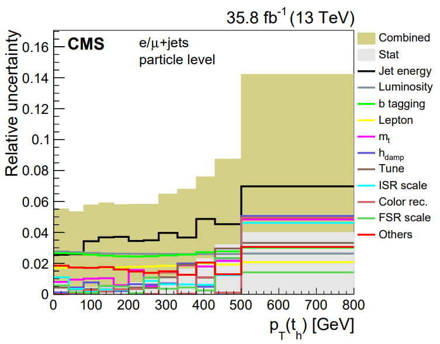

:::::::::::::::::::::::::::::::::::::: questions 

- Where do uncertainties come from in CMS analysis?
- How important are uncertainties to our results?

::::::::::::::::::::::::::::::::::::::::::::::::

::::::::::::::::::::::::::::::::::::: objectives

- Identify the major types of uncertainties typically found in CMS analyses
- Review examples from papers of the impact of uncertainties on the physics results

::::::::::::::::::::::::::::::::::::::::::::::::

. In CMS, the epistemic uncertainty is perhaps "how many unknown bugs did I introduce in my code?"](fig/epistemic_uncertainty_2x.png){width="65%"}

All CMS algorithms are subject to uncertainty. Such is life!

## Types of uncertainty

The typical CMS analysis will need to consider the following types of uncertainty:

 * **Statistical**: uncertainty due to limited sample size, either in data or simulation.
 * **Systematic**: uncertainty due to any other source!
   * Collisions: the luminosity collected by CMS carries an uncertainty of just over 1%, and the calculation of the number of simultaneous collisions per bunch crossing also has uncertainty. 
   * Theory: when using simulation, limited-order generation and the use of parton density functions contribute some uncertainty to the accuracy of the simulation.
   * Detector: reconstruction algorithms used by CMS are never perfectly modeled by simulation. Correcting physics objects for imperfect detector response, applying identification algorithms, or even selecting events using trigger paths require calibration of how the decision affects data versus simulation. Computing adjustments to the simulation brings along uncertainties.
   * Method: all analyses must choose how they will model background, calculate observables, etc. Many of these choices can contribute uncertainties.

The type of analysis determines which uncertainties are the most significant. Searches for new physics at high energies are often, but not always, limited by the available size of the dataset. This can make constraining systematic uncertainties less important than simply designing effective selection criteria to remove background events. Measurements of particle properties are often in the opposite regime -- for many SM particles even partial CMS datasets already provide massive samples that are useful for precision measurements. The precision, and therefore the impact, of these measurements can depend heavily on making analysis choices that contribute the smallest possible uncertainties.

## Top quark cross section measurement

The top quark cross section was measured in several different final states using the CMS 2016 dataset. The [single lepton differential cross section measurement](https://arxiv.org/pdf/1803.08856) using this dataset shares a breakdown of all their uncertainties:

{width="50%"}

This figure shows that over a wide range of hadronic top quark momentum, the statistical uncertainty is completely negligible compared to systematic uncertainty. The experimental uncertainty groups (Jet energy, Luminosity, b tagging, and Lepton) tend to be larger than the other uncertainties, which are related to generation settings for the top pair simulation. 

## $Z'$ search

The [$Z'$ search](https://arxiv.org/pdf/1810.05905) that we are using as an analysis inspiration uses many of the same individual uncertainties, but their impact is different. In this analysis the selection criteria are very stringent and few data events are left in the regions dominated by $Z'$ signal:

In fact, in order to perform the statistical inference for this analysis, these histograms had to be rebinned such that the statistical uncertainty stayed below 30\% in each bin. The systematic uncertainties become less important in this search, especially for the higher mass signal. The authors note that including the systematic uncertainties in the fit at all have only a 10\% effect on the mass limit for $Z'$ masses above about 2 TeV.

In the following episodes we will look more closely at the different sources of CMS experimental uncertainty and practice evaluating some uncertainties in our analysis example.

::::::::::::::::::::::::::::::::::::: keypoints 

- Uncertainties are always divided into statistical and systematic components
- Many precision measurements also divide out luminosity and/or theory uncertainties

::::::::::::::::::::::::::::::::::::::::::::::::

